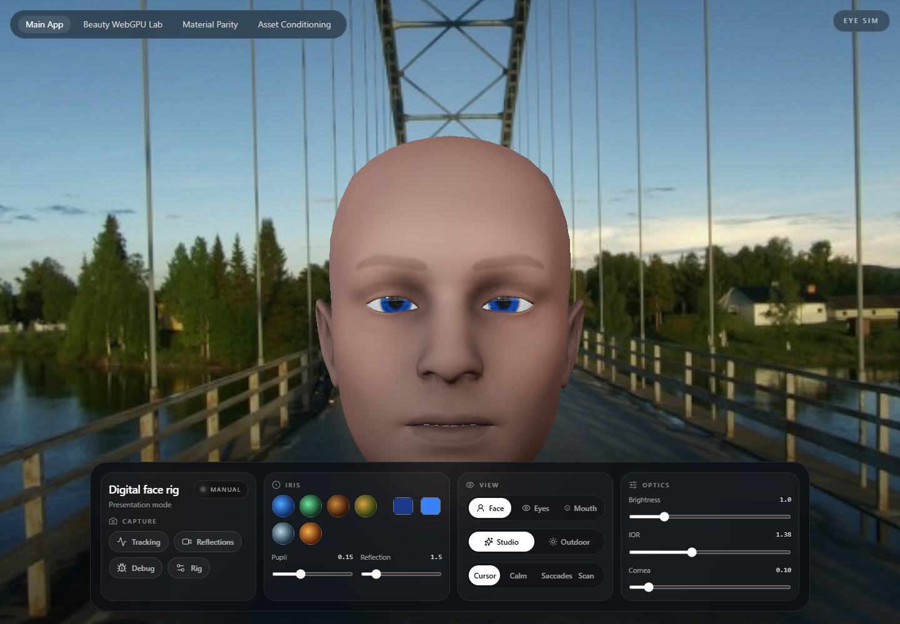

# Eye Sim

Eye Sim is a React + Three.js digital face rig presentation system with procedural eyes as the hero feature. The default route is the product surface: a polished face rig with opt-in tracking, shot-based presentation modes, and release-safe controls.

The repo also contains isolated lab routes under `/labs/*` for material parity, beauty shading, WebGPU diagnostics, and offline Facecap conditioning. Labs are intentionally separated from the default experience and may be unstable or renderer-specific.

## Latest Proof

The strongest current slice is the procedural-head route on `codex/procedural-head-generator`. It adds a generator-backed face runtime, mouth shaping, and a dedicated product-facing route without collapsing the existing product/lab boundary.

- Proof page: [`docs/proof/procedural-head.md`](./docs/proof/procedural-head.md)
- Captured artifacts:
  - [`docs/proof/procedural-head/desktop-face-rig.png`](./docs/proof/procedural-head/desktop-face-rig.png)
  - [`docs/proof/procedural-head/mouth-closeup.png`](./docs/proof/procedural-head/mouth-closeup.png)
  - [`docs/proof/procedural-head/mobile-face-rig.png`](./docs/proof/procedural-head/mobile-face-rig.png)

## Stack

- React 19 + Vite
- Three.js / React Three Fiber / Drei
- MediaPipe face landmarker
- Leva for live controls

## Run Locally

Prerequisite: Node.js 22+ and `pnpm`.

1. Install dependencies:
   `pnpm install`
2. Start the dev server:
   `pnpm dev`
3. Open `http://localhost:3003`

## Commands

- `pnpm dev` starts the local app.
- `pnpm build` builds the production bundle.
- `pnpm lint` runs the TypeScript no-emit check.
- `pnpm inspect:facecap` prints ranked eye-mesh candidates for the facecap asset.
- `pnpm condition:facecap` regenerates the conditioned facecap payload under `data/conditioning/`.

## Project Layout

- `src/routes/` contains the main app route and lab routes.
- `src/routes/MainRoute.tsx` is the product surface.
- `src/routes/*LabRoute.tsx` and other `/labs/*` routes are investigation surfaces, not product defaults.
- `src/features/presentation/` contains shot definitions for camera framing, scale, defaults, and release-safe interaction boundaries.
- `src/features/tracking/` contains the tracking adapter contract plus MediaPipe pipeline modules.
- `src/features/face/` contains face runtime, eye-fit, and material modules.
- `public/models/` and `public/vendor/` store deterministic runtime assets for Facecap, MediaPipe, and Basis transcoding.
- `data/conditioning/` stores generated conditioning payloads and manifests.
- `scripts/conditioning/probes/` contains one-off inspection probes for the conditioning bake.

## Product/Lab Boundary

The Beauty WebGPU Lab should stay in this repo until the shot system and face rig runtime stabilize. It should become a separate package only if it starts needing its own renderer lifecycle, asset bake cadence, or shader test harness that would slow down the main face rig release path.
