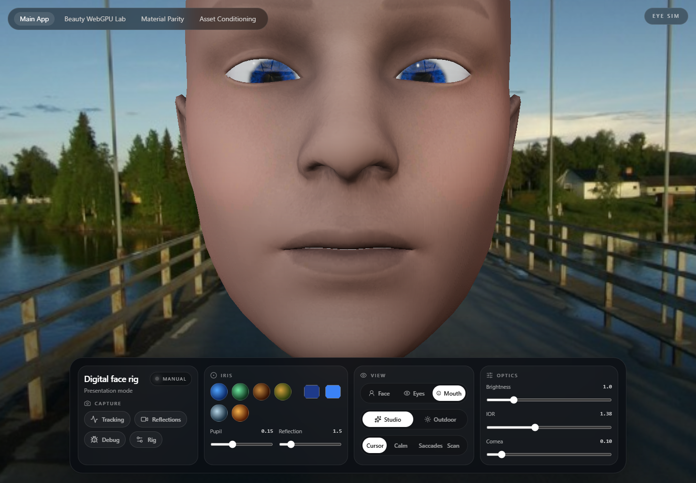
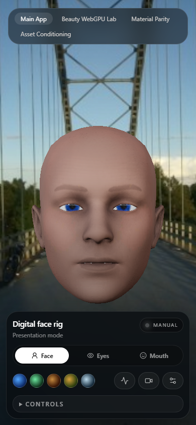

# Procedural Head Proof Pack

This page surfaces the procedural-head slice that landed on `codex/procedural-head-generator`. The underlying work is substantial renderer-facing product work, not just a presentation pass:

- new `ProceduralHeadRoute` entry point for a product-facing generator surface
- generator-backed geometry, materials, and deterministic randomization under `src/features/procedural-head/`
- mouth-system iteration and route-level runtime hardening in the April 23 follow-up commit

## What This Proves

The repo now has a credible public artifact set for the procedural-head route:

- a desktop product surface with the face rig centered and the operator controls visible
- a mouth close-up that surfaces the latest shaping work instead of hiding it in code
- a mobile layout that still reads as a product surface on a narrow viewport

## Artifact Index

### Desktop product surface

- Source capture: `output/playwright/rethought-desktop-final.png`
- Why it matters: shows the route framing, control density, and presentation target in one frame

### Mouth close-up

- Source capture: `output/playwright/rethought-mouth-final.png`
- Why it matters: surfaces the mouth-system pass that would otherwise only be visible in the diff

### Mobile layout

- Source capture: `output/playwright/rethought-mobile-final.png`
- Why it matters: proves the route still works as a release surface on mobile instead of collapsing into a desktop-only debug panel

## Validation

- `pnpm lint`

## Still Missing

This closes the screenshot proof gap, but the slice still lacks:

- a short demo capture showing tracking and expression changes over time
- performance notes or frame-time evidence for the procedural-head route
- a portfolio-facing case-study page outside the repo README
